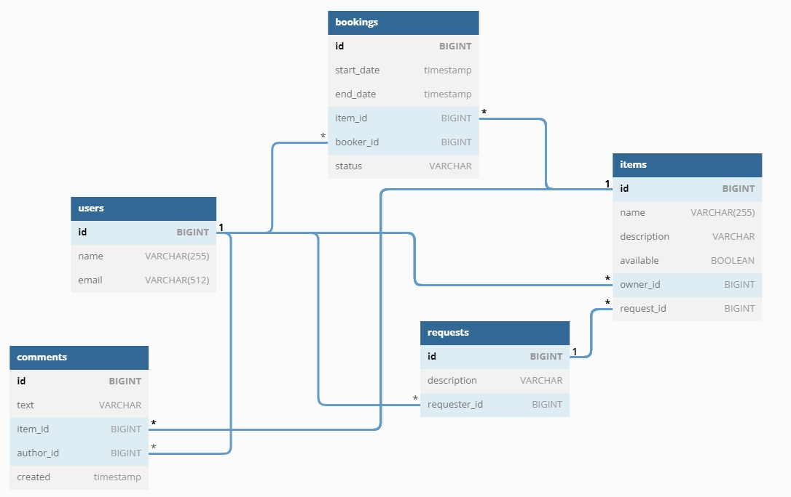

# java-shareit
Проект 4го модуля курса Java разработчик Яндекс.Практикум.

В проекте реализован бекенд сервиса бронирования вещей. Бекенд представляет собой REST-API контроллер.

В текущий момент реализована функциональность добавления, удаления, изменения пользователей, добавления, удаления,
изменения вещей, создания, подтверждения, изменения статусов бронирований и добвления комментариев.

Бэкенд работает с БД postgreeSql. 

Схема БД

Выполнил Красногорский Михаил mikser256@yandex.ru
